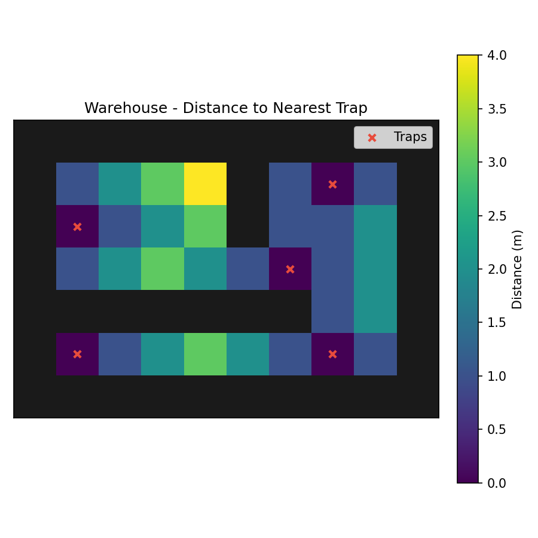

# BioPath Report: Warehouse

- Cell size (m): 1.0
- Walkable cells: 32
- Trap count: 5
- Objective (capture_prob): 0.912
- Mean distance (m): 1.469
- Weighted mean distance (m): 1.469
- Max distance (m): 4.000
- P95 distance (m): 3.000

## Traps (row, col)
- (3, 6)
- (2, 1)
- (5, 1)
- (1, 7)
- (5, 7)

## Heatmap

