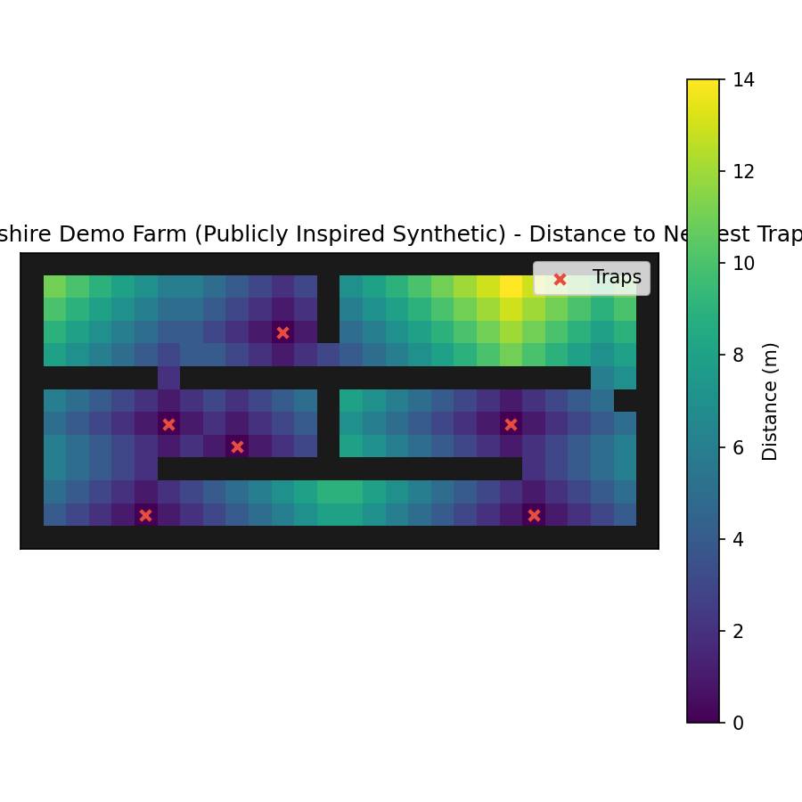

# BioPath Report: Cambridgeshire Demo Farm (Publicly Inspired Synthetic)

- Cell size (m): 1.0
- Walkable cells: 240
- Trap count: 6
- Objective (robust_capture): 0.444
- Mean distance (m): 5.150
- Weighted mean distance (m): 5.150
- Max distance (m): 14.000
- P95 distance (m): 11.000

## Traps (row, col)
- (3, 11)
- (11, 5)
- (7, 21)
- (8, 9)
- (11, 22)
- (7, 6)

## Heatmap

