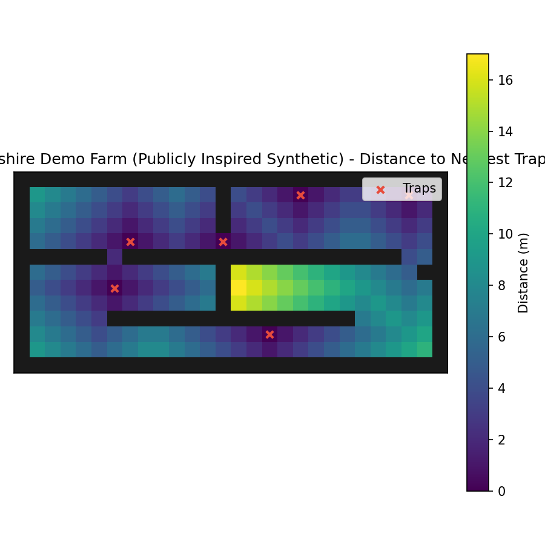

# BioPath Report: Cambridgeshire Demo Farm (Publicly Inspired Synthetic)

- Cell size (m): 1.0
- Walkable cells: 240
- Trap count: 6
- Objective (robust_capture): 0.350
- Mean distance (m): 5.208
- Weighted mean distance (m): 5.208
- Max distance (m): 17.000
- P95 distance (m): 13.000

## Traps (row, col)
- (4, 13)
- (7, 6)
- (1, 18)
- (10, 16)
- (4, 7)
- (1, 25)

## Heatmap

