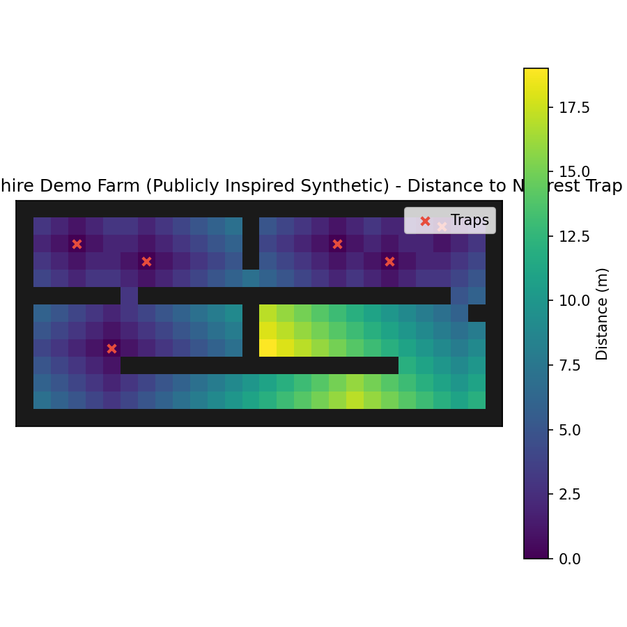

# BioPath Report: Cambridgeshire Demo Farm (Publicly Inspired Synthetic)

- Cell size (m): 1.0
- Walkable cells: 240
- Trap count: 6
- Objective (capture_prob): 0.600
- Mean distance (m): 6.117
- Weighted mean distance (m): 6.117
- Max distance (m): 19.000
- P95 distance (m): 16.000

## Traps (row, col)
- (3, 21)
- (3, 7)
- (2, 3)
- (1, 24)
- (8, 5)
- (2, 18)

## Heatmap

