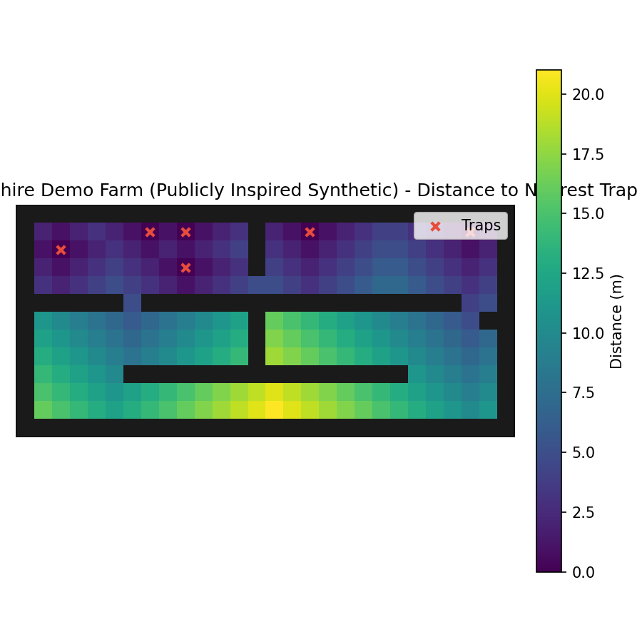

# BioPath Report: Cambridgeshire Demo Farm (Publicly Inspired Synthetic)

- Cell size (m): 1.0
- Walkable cells: 240
- Trap count: 6
- Objective (capture_prob): 0.400
- Mean distance (m): 8.171
- Weighted mean distance (m): 8.171
- Max distance (m): 21.000
- P95 distance (m): 18.000

## Traps (row, col)
- (1, 25)
- (1, 9)
- (3, 9)
- (2, 2)
- (1, 7)
- (1, 16)

## Heatmap

