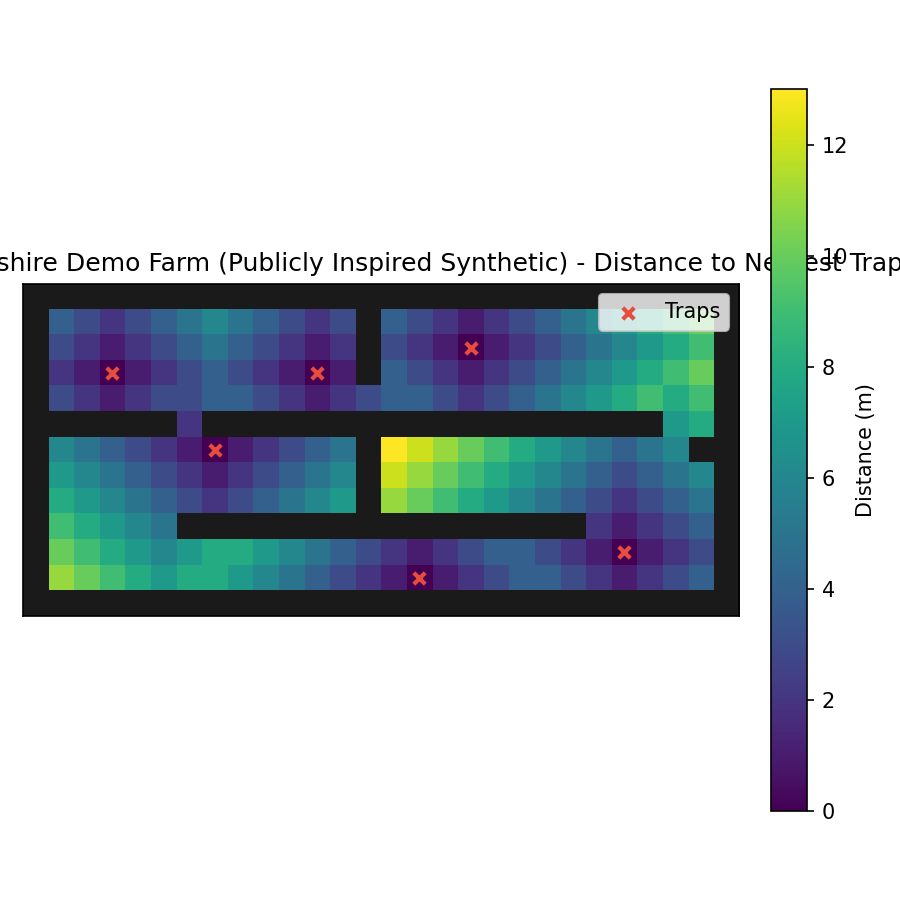

# BioPath Report: Cambridgeshire Demo Farm (Publicly Inspired Synthetic)

- Cell size (m): 1.0
- Walkable cells: 240
- Trap count: 6
- Objective (robust_capture): 0.481
- Mean distance (m): 4.521
- Weighted mean distance (m): 4.521
- Max distance (m): 13.000
- P95 distance (m): 10.000

## Traps (row, col)
- (10, 23)
- (3, 11)
- (6, 7)
- (2, 17)
- (11, 15)
- (3, 3)

## Heatmap

