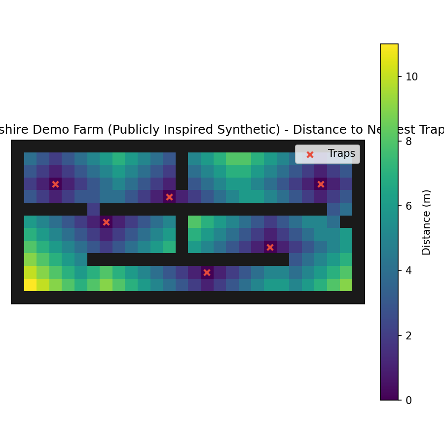

# BioPath Report: Cambridgeshire Demo Farm (Publicly Inspired Synthetic)

- Cell size (m): 1.0
- Walkable cells: 240
- Trap count: 6
- Objective (robust_capture): 0.450
- Mean distance (m): 4.233
- Weighted mean distance (m): 4.233
- Max distance (m): 11.000
- P95 distance (m): 8.000

## Traps (row, col)
- (8, 20)
- (3, 24)
- (3, 3)
- (10, 15)
- (4, 12)
- (6, 7)

## Heatmap

