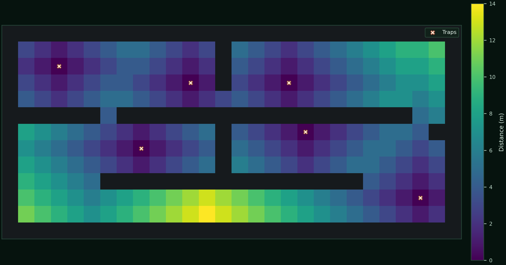

# BioPath Report: Cambridgeshire Photo-informed Demo Farm (Synthetic Geometry + Publicly Inspired Risk Prior)

- Cell size (m): 1.0
- Walkable cells: 240
- Trap count: 6
- Objective (robust_capture): 0.625
- Mean distance (m): 4.600
- Weighted mean distance (m): 4.204
- Max distance (m): 14.000
- P95 distance (m): 11.000
- Weight total: 507.746

## Traps (row, col)
- (10, 25)
- (6, 18)
- (3, 17)
- (7, 8)
- (2, 3)
- (3, 11)

## Heatmap

