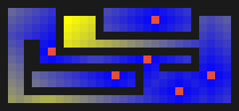

# BioPath Report: Cambridgeshire Farmyard Demo (Synthetic Geometry + Publicly Inspired Risk Prior)

- Cell size (m): 1.0
- Walkable cells: 240
- Trap count: 6
- Objective (robust_capture): 0.525
- Mean distance (m): 6.558
- Weighted mean distance (m): 6.223
- Max distance (m): 25.000
- P95 distance (m): 21.000
- Weight total: 428.410

## Traps (row, col)
- (11, 22)
- (2, 19)
- (9, 14)
- (7, 18)
- (6, 6)
- (9, 26)

## Heatmap

