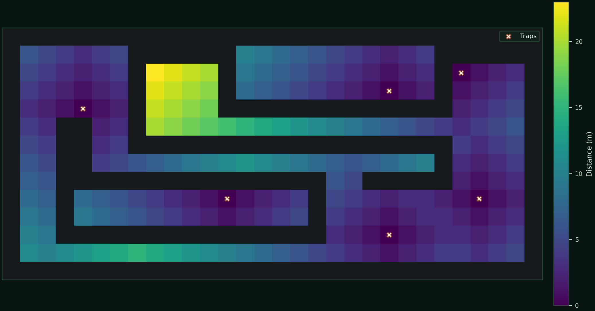

# BioPath Report: Cambridgeshire Farmyard Demo (Synthetic Geometry + Publicly Inspired Risk Prior)

- Cell size (m): 1.0
- Walkable cells: 240
- Trap count: 6
- Objective (capture_prob): 0.550
- Mean distance (m): 5.933
- Weighted mean distance (m): 6.082
- Max distance (m): 23.000
- P95 distance (m): 19.000
- Weight total: 428.410

## Traps (row, col)
- (11, 21)
- (4, 4)
- (9, 12)
- (9, 26)
- (3, 21)
- (2, 25)

## Heatmap

