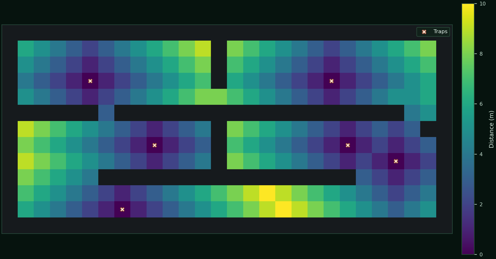

# BioPath Report: Cambridgeshire Farmyard Demo (Synthetic Geometry + Publicly Inspired Risk Prior)

- Cell size (m): 1.0
- Walkable cells: 240
- Trap count: 6
- Objective (robust_capture): 0.531
- Mean distance (m): 4.225
- Weighted mean distance (m): 3.935
- Max distance (m): 10.000
- P95 distance (m): 8.000
- Weight total: 434.236

## Traps (row, col)
- (8, 24)
- (3, 5)
- (7, 9)
- (7, 21)
- (11, 7)
- (3, 20)

## Heatmap

