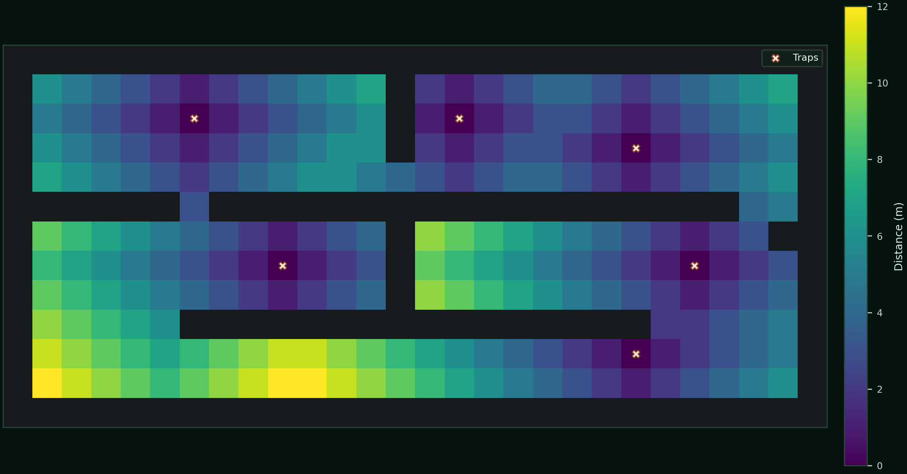

# BioPath Report: Cambridgeshire Photo-informed Demo Farm (Synthetic Geometry + Publicly Inspired Risk Prior)

- Cell size (m): 1.0
- Walkable cells: 240
- Trap count: 6
- Objective (capture_prob): 0.593
- Mean distance (m): 4.533
- Weighted mean distance (m): 4.268
- Max distance (m): 12.000
- P95 distance (m): 10.000
- Weight total: 507.746

## Proof Contract
- Run ID: 20260224T204100Z-dc384c1e
- Capture probability: 59.3%
- Robust score (scenario min): 38.6%
- Capture 95% CI: [51.1%, 67.4%]
- Expected time to capture (steps): 29.957
- Monte Carlo runs: 140
- Time horizon (steps): 48
- Movement model: lazy
- Seed: 7

## Scenario Scores
- lazy_neutral: capture 47.1%, CI [38.9%, 55.4%], E[T]=34.829
- biased_right: capture 60.7%, CI [52.6%, 68.8%], E[T]=30.829
- biased_down: capture 38.6%, CI [30.5%, 46.6%], E[T]=37.521

## Traps (row, col)
- (10, 21)
- (2, 6)
- (7, 9)
- (7, 23)
- (2, 15)
- (3, 21)

## Heatmap

