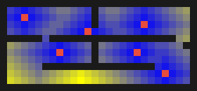

# BioPath Report: Cambridgeshire Farmyard Demo (Synthetic Geometry + Publicly Inspired Risk Prior)

- Cell size (m): 1.0
- Walkable cells: 240
- Trap count: 6
- Objective (robust_capture): 0.588
- Mean distance (m): 4.342
- Weighted mean distance (m): 4.099
- Max distance (m): 13.000
- P95 distance (m): 10.000
- Weight total: 434.236

## Traps (row, col)
- (4, 12)
- (7, 8)
- (7, 19)
- (2, 3)
- (3, 20)
- (10, 23)

## Heatmap

