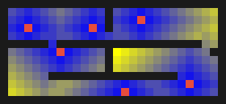

# BioPath Report: Cambridgeshire Demo Farm (Publicly Inspired Synthetic)

- Cell size (m): 1.0
- Walkable cells: 240
- Trap count: 6
- Objective (robust_capture): 0.481
- Mean distance (m): 4.521
- Weighted mean distance (m): 4.521
- Max distance (m): 13.000
- P95 distance (m): 10.000

## Proof Contract
- Run ID: 20260228T034955Z-49496b78
- Capture probability: 48.1%
- Robust score (scenario min): 48.1%
- Capture 95% CI: [40.4%, 55.9%]
- Expected time to capture (steps): 34.962
- Monte Carlo runs: 160
- Time horizon (steps): 48
- Movement model: lazy
- Seed: 7

## Scenario Scores
- lazy_neutral: capture 48.1%, CI [40.4%, 55.9%], E[T]=34.962
- biased_right: capture 56.2%, CI [48.6%, 63.9%], E[T]=30.238
- biased_down: capture 50.0%, CI [42.3%, 57.7%], E[T]=32.212

## Traps (row, col)
- (10, 23)
- (3, 11)
- (6, 7)
- (2, 17)
- (11, 15)
- (3, 3)

## Heatmap

